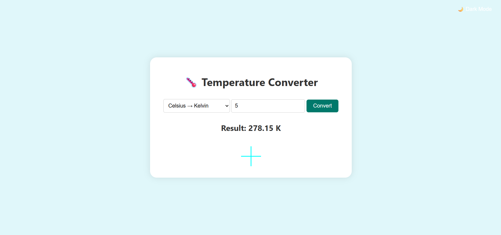
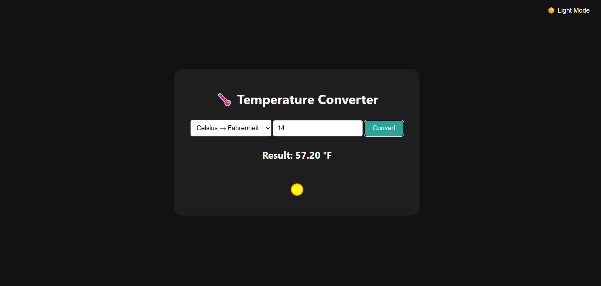

# 🌡️ Temperature Converter 

An interactive, responsive, and user-friendly temperature converter built using HTML, CSS, and JavaScript.  
Convert between **Celsius**, **Fahrenheit**, and **Kelvin** easily with real-time feedback, icons, and animations.

---

## 🌟 Features

✅ Convert between Celsius, Fahrenheit, and Kelvin  
✅ Dynamic temperature-based icons (🌞 / ❄️)  
✅ Light and Dark mode toggle  
✅ Smooth UI animations and transitions  
✅ Clean, mobile-friendly, and responsive design  
✅ Pure frontend project (no backend required)

---

## 🛠 Tech Stack

**Frontend:**
- HTML5  
- CSS3  
- JavaScript  
- Base64 Icons  
- Animations with CSS transitions  

**Tools:**
- VS Code (recommended)
- GitHub for version control
- Live Server for local testing

---

## 📜 Pages

1️⃣ **Main Page** – Input a temperature and choose the unit to convert.  
2️⃣ **Theme Toggle** – Switch between light and dark mode.  
3️⃣ **Visual Feedback** – See temperature-related icons and animated output.  

---

## 👨‍💻 Team Members
| Name         | ID      |
|--------------|---------|
| Ahmed Faiza  | C231465 |

---

## 📌 Setup & Installation

1️⃣ **Clone the Repository**  
```bash
git clone https://github.com/your-username/temperature-converter.git
```

2️⃣ **Open in VS Code**  
Launch the project folder using Visual Studio Code.

3️⃣ **Run the App**  
Use the **Live Server** extension or open `index.html` directly in a browser.

---

## 📅 Development Roadmap

🟢 **Phase 1** – Layout and basic temperature conversion logic  
🟡 **Phase 2** – Add dark/light theme toggle  
🔵 **Phase 3** – Integrate dynamic temperature-based icons  
🟣 **Phase 4** – Polish UI and animations, finalize visuals

---

## 📸 Screenshots

### 🌞 Light Mode


### 🌙 Dark Mode


## 📄 License

This project is licensed under the [MIT License](LICENSE).

---

🎯 **Making science simple and beautiful!** 🌡️
